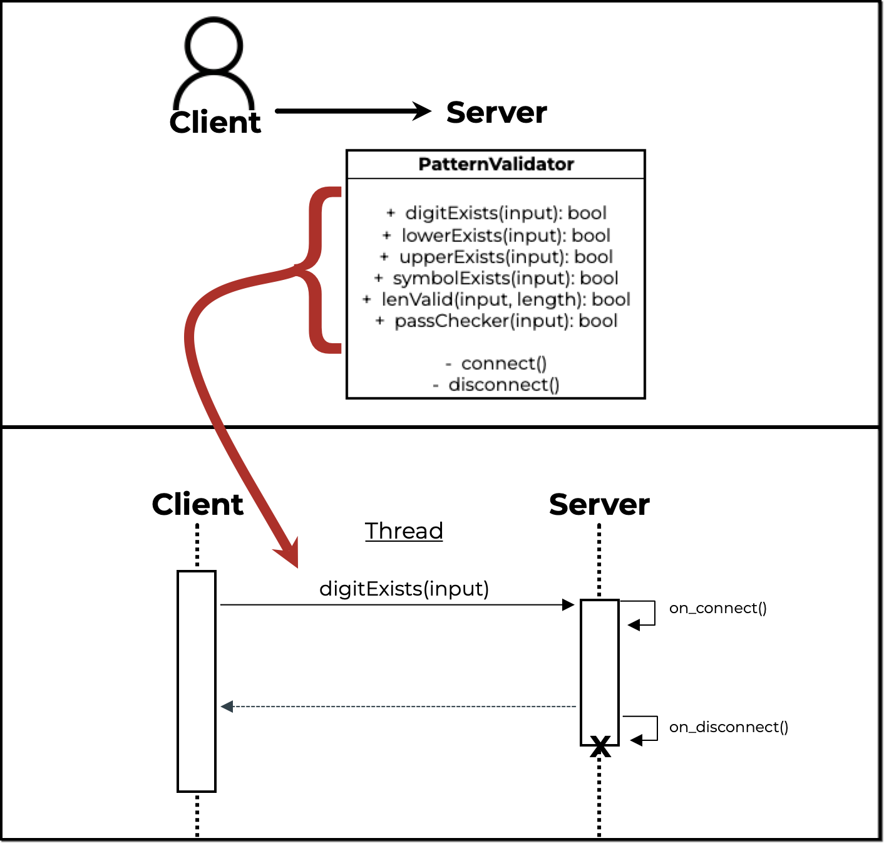

- [Vish's Microservice for CS361](#vish-s-microservice-for-cs361)
  * [Installation](#installation)
    + [Regular Installation into Packages](#regular-installation-into-packages)
    + [Project Virtual Environment Installation](#project-virtual-environment-installation)
      - [Setup virtualenv](#setup-virtualenv)
      - [Install RPyC](#install-rpyc)
      - [Deactivate](#deactivate)
  * [Getting Started](#getting-started)
    + [How it works | How to Make Requests and Receive Data](#how-it-works)
    + [UML Diagram](#uml-diagram)
    + [Run server.py locally](#run-serverpy-locally)
  * [Usage/Examples](#usage-examples)
  * [Documentation](#documentation)


# Vish's Microservice for CS361

*Communication Contract for String Validation & Password Checker Microservice*

## Installation

<details><summary>Installation Instructions</summary>

This section provides instruction on how to install the [RPyC module](https://pypi.org/project/rpyc/) necessary to setup the remote procedure calls of this microservice.

Note:
- Python 3+ is required to run the microservice server
- I mentioned `pip3` as the package manager command specifically, but you can use `pip` if `pip` has already been aliased with `pip3`.

### Regular Installation into Packages

```bash
pip3 install rpyc
```

### Project Virtual Environment Installation

#### Setup virtualenv
- If your system does not have virtualenv, then install with:

    ```bash
    pip3 install virtualenv
    ```
- Change directory in bash with
    ```bash
    cd project-folder-name
    ```
- Initialize virtualenv with:
    ```bash
    virtual venv
    ```
- Activate virtualenv:
    ```bash
    source venv/bin/activate
    ```
#### Install RPyC
Once you've activated the virtual environment, install the rpyc module with:
```bash
pip3 install rpyc
```

#### Deactivate
You can close the virtual environment in bash with:
```bash
deactivate
```

</details>

## Getting Started

You are going to run the server locally and enable your application to send/receive the response.

You may choose to clone this project directly to get usage examples and the server.py file, or you can recreate entirely by following the Instructions section and running the server.py code locally.

### How it works
1. As mentioned previously, this microservice uses the RPyC communcation pipe and provides string validation and functions as a password criteria verification system. A client can send a request to the microservice with a string, and this microservice will return a boolean confirming whether the provided input meets some predefined criteria.
2. To start, the microservice is initiated by running a server.py file that waits for incoming messages. A client can connect on the same port and access an exposed set of functionality available from the server.py microservice. This is as simple as accessing a connection via the rpyc module on a specific port, and then running a “root” request.


3. Clients receive data from my microservice while making a request to the exposed functionality in the server.py file. The received data can be stored in a variable from the calling client.


### UML Diagram



### Run server.py locally
- Clone/save the [server.py](server.py) file OR copy and save code below in your project folder where `rpyc` was installed

    ```python
    # =================================================================
    #   Vishwas Sastry
    #   CS361 | Summer 2022
    #   Microservice - String Validator
    #   Remote Procedure Call: Initiate Server
    #   References:
    #       - https://rpyc.readthedocs.io/en/latest/tutorial/tut3.html
    # =================================================================
    import rpyc
    import re

    PORT = 3776

    class PatternValidator(rpyc.Service):
        def on_connect(self, conn):
            print("Thread Initiated")

        def on_disconnect(self, conn):
            print("Thread Closed")

        def exposed_digitExists(self, input):
            compile = re.compile('\d')
            return bool(compile.search(input))

        def exposed_lowerExists(self, input):
            compile = re.compile('[a-z]')
            return bool(compile.search(input))

        def exposed_upperExists(self, input):
            compile = re.compile('[A-Z]')
            return bool(compile.search(input))

        def exposed_symbolExists(self, input):
            compile = re.compile('!@#$%^&*()-_=+')
            return bool(compile.search(input))

        def exposed_lenValid(self, input, length):
            return bool(len(input) >= length)

        # Reference: https://uibakery.io/regex-library/password-regex-python
        # Method checks input requirements according to Mark Jordan's specific password requirements
        # Built for simplicity -- exposed_passParameters() can be used for variable requirements
        def exposed_passChecker(self, input):
            pattern = "^(?=.*?[A-Z])(?=.*?[a-z])(?=.*?[0-9])(?=.*?[!@#$%^&*()-_=+]).{12,}$"
            return bool(re.match(pattern, input))

    if __name__ == "__main__":
        print("\nServer Live. Waiting for Requests. Press Ctrl + C to cancel")
        from rpyc.utils.server import ThreadedServer
        t = ThreadedServer(PatternValidator, port=PORT)
        t.start()

    ```

- Change the `PORT` value as necessary

- Start the microservice server to await client calls

    ```bash
    python3 server.py
    ```
- Now that you've run the `server.py` file, the microservice is active and can be terminated with `Ctrl + C`
- After terminating the microserver, don't forget to run `deactivate` in the terminal if you're running an virtualenv

## Usage/Examples

### How to make requests to the microservice from your application (YOUR_CLIENT_FILE.py)
Like the server.py file, your application will need to import the `rpyc` module and be capable of running `python3` code. Follow the Installation instructions & reference the Documentation to setup `rpyc` in your application.

**Client - Setup:**
```python
import rpyc

PORT = 3776 # Use the same PORT as the server.py file
connection = rpyc.connect("localhost", PORT) # Initialize the connection
```
**NEXT**
- The variable you used to establish the connection to the microservice can be used to access any `exposed_` method in `server.py` when followed by the dot `.` prefix and `root`
____

<details><summary>CODE EXAMPLES</summary>

#### Example 1A: Print boolean of whether string input contains digits
```python
noDigits = "HelloWorld!!!"
print("noDigits", connection.root.digitExists(noDigits)) # print False | no digits in string
```
#### Example 1B: Print boolean of whether string input contains digits
```python
noLower = "HELLOWORLD123!"
print("HasDigits", connection.root.digitExists(noLower)) # print True | string has digits
```
#### Example 2A: Print boolean of whether string input
```python
noLower = "HELLOWORLD123!"
print("noLower", connection.root.lowerExists(noLower)) # print False | no lowercase in string
```
#### Example 2B: Print boolean of whether string input
```python
noUpper = "helloworld123_"
print("HasLower", connection.root.lowerExists(noUpper)) # print True | string has lowercase
```

#### Example 3A: Print boolean of whether string input
```python
noUpper = "helloworld123_"
print("noUpper", connection.root.upperExists(noUpper)) # print False | no uppercase in string
```
#### Example 3B: Print boolean of whether string input
```python
noLower = "HELLOWORLD123!"
print("HasUpper", connection.root.upperExists(noLower)) # print True | string has uppercase
```

#### Example 4A: Print boolean of whether string input
```python
tooShort = "hello1!"
print("tooShort", connection.root.lenValid(tooShort, 12)) # print False | string not >= 12
```
#### Example 4B: Print boolean of whether string input
```python
noDigits = "HelloWorld!!!"
print("CorrectLength", connection.root.lenValid(noDigits, 12)) # print True | string >= 12
```

#### Example 5: passChecker(): returns True if input's length >= 12, has digits, has lowercase, has uppercase, has symbol from 0-9 number key row
```python
correct = "HelloWorld123!@#"
print("correct", connection.root.passChecker(correct)) # print True
print("direct_correct", connection.root.passChecker("He11()W()r1d")) # print True
```
</details>

### How to receive data from the microservice to your application
- The examples in the client.py above section showcase how to send an input string to the microservice, have the microservice perform a calculation, and finally have the microservice respond with the results of its internal method call with a boolean return
- The boolean results from the microservice are also clearly captured in the print statements from the client calls, however, you can take these examples further by implementing logic based on the microservice response
For example, the following code in client.py sends a message to the microservice on the same port and requests a validation check on the variable `tooShort`:
```python
connection = rpyc.connect("localhost", PORT) # Initialize the connection
tooShort = "hello1!"

tooShortValid = connection.root.lenValid(tooShort, 12)
```
The microservice is actively listening on the designated `PORT`. Once the message from the client is received, the microservice passes the client input through its exposed lenValid() method:
```python
def exposed_lenValid(self, input, length):
    return bool(len(input) >= length)
```
The result of this (in this case `False`, since `tooShort`'s length is < 12), is returned from the microservice and stored in the `tooShortValid` variable in the client application code. This also closes the communication thread instance between client.py and server.py, but server.py continues to listen for other requests on the same `PORT`.
With the result of `lenValid(tooShort, 12)` now stored in `tooShortValid`, the client application can use it in additional conditional code or loops:
```python
if !tooShortValid:
    # do something
else:
    # do something else
```
## Documentation

[Main Documentation - RPyc Docs](https://rpyc.readthedocs.io/)
